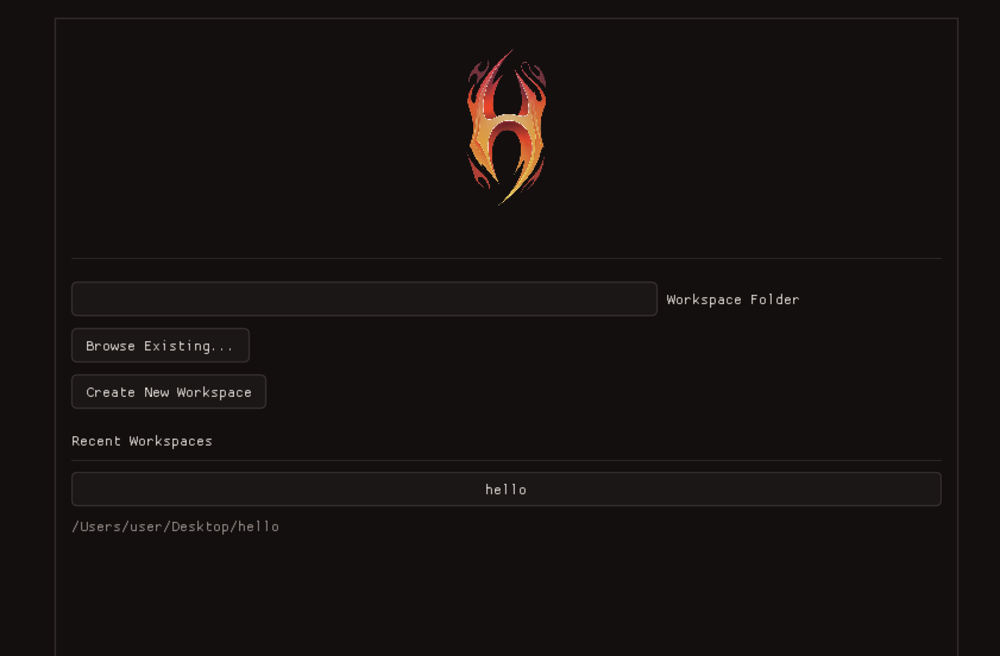
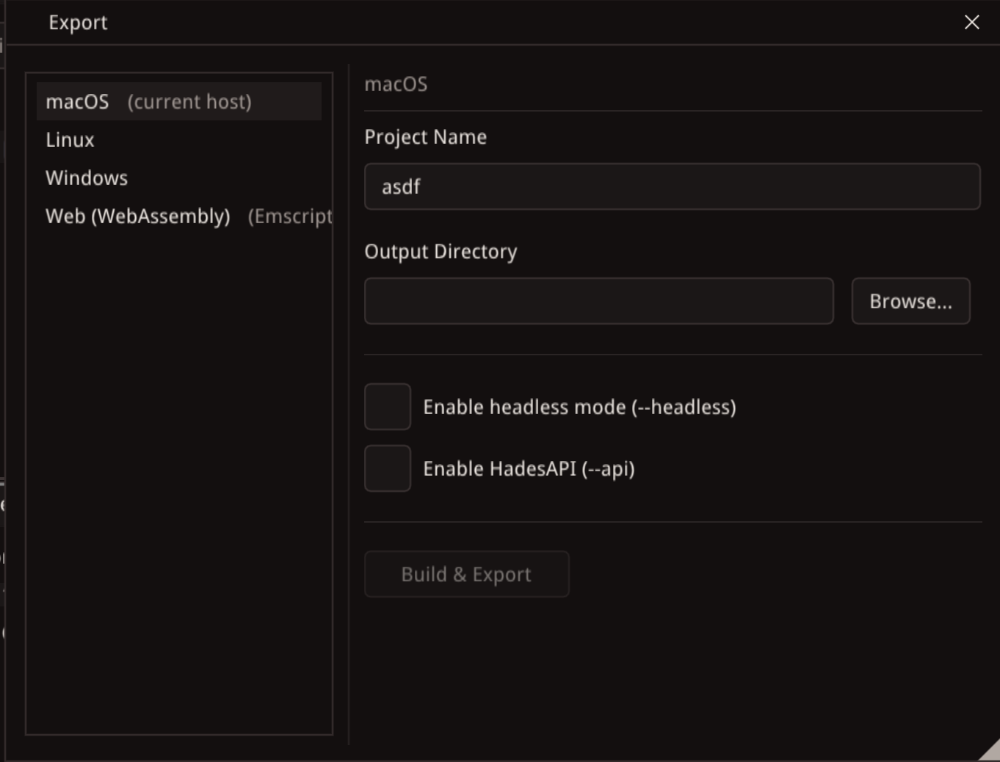
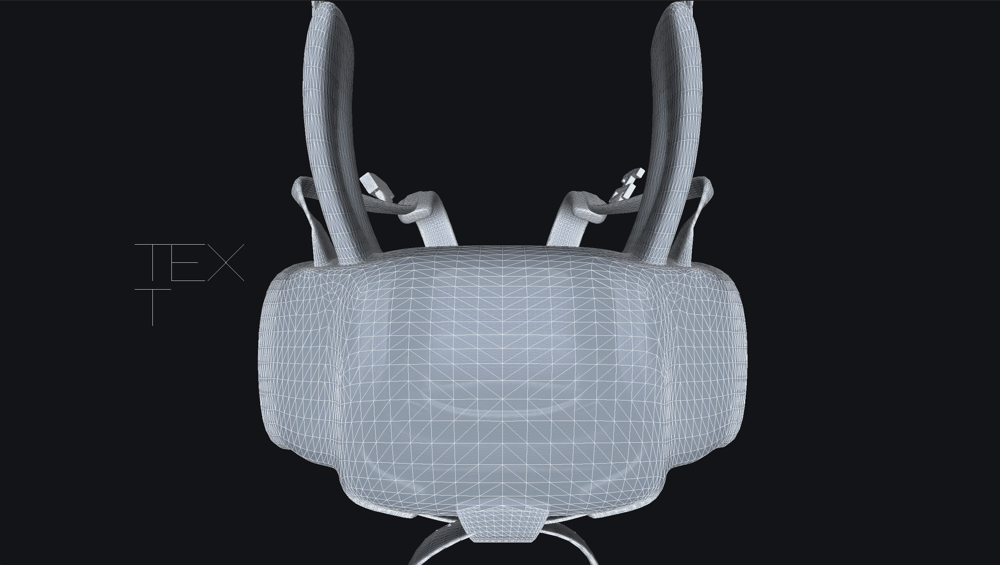

# Hades - Light C++ 3D Game Engine

[](https://github.com/nenuadrian/hades-game-engine/actions/workflows/cmake-multi-platform.yml)
[](https://github.com/nenuadrian/hades-game-engine/actions/workflows/docs-pages.yml)
[](https://github.com/nenuadrian/hades-game-engine/actions/workflows/docker-build.yml)

## Overview

A C++ 3D game engine with a Vulkan renderer, in-process C++ scripting, spatial audio, and an ImGui-based editor. Built around a custom Entity-Component-System architecture.

The purpose is educational and experimental, to explore the intriguing world of game engine development and to enable quick use of environments created for machine learning/AI training through headless mode and a flexible API.

<p align="center">
    
</p>

## Features








**Rendering**

- Vulkan-based renderer with swapchain management, frame synchronization, and debug validation layers
- ImGui integration with docking and multi-viewport support
- Software-rasterised 3D model preview (wireframe and flat-shaded)
- Vector-based 3D text rendering with wrapping, line spacing, and Euler angle rotation

**Entity-Component-System**

- Custom ECS with `EntityManager`, `ComponentManager`, and `SystemManager`
- 13 component types: `PositionComponent2D`, `PositionComponent3D`, `TransformHierarchyComponent`, `CameraComponent`, `ModelComponent`, `RenderComponent`, `PrimitiveComponent`, `TextComponent`, `AudioSourceComponent`, `AudioListenerComponent`, `NameComponent`, `WorldComponent`, `ScriptComponent`
- 3 runtime systems: `AudioSystem`, `MovementSystem`, `RenderSystem`
- Parent-child entity hierarchy via `TransformHierarchyComponent`
- Multi-world scene management with default world selection
- JSON serialization for worlds and entities

**Scripting**

- C++ scripting compiled into shared libraries at play start
- Direct ECS access from scripts -- no marshaling or IPC overhead
- Mouse and keyboard input callbacks
- World loading API for scene transitions
- Screen-to-world raycasting utilities for entity picking
- Background workspace script compilation with error reporting
- See [SCRIPTING.md](SCRIPTING.md) for details

**Audio**

- miniaudio-based audio engine with 3D spatial audio
- 4 audio buses: Master, Music, Sfx, Voice with independent volume control
- Per-source properties: volume, pitch, looping, streaming, spatialization
- Distance-based attenuation with min/max range and rolloff control

**Asset Importing**

- 3D model loading via Assimp (FBX, glTF, OBJ, DAE, 3DS, Blender, USD, and 40+ formats)
- Post-processing: triangulation, vertex deduplication, cache optimization
- Bounding box computation for imported models

**Editor**

- Workspace-based project management with file tree navigation
- Entity hierarchy panel with drag-based re-parenting
- 3D scene viewport with orbit camera and transform gizmos (per-axis drag)
- Properties and Components inspector with per-component editing
- Integrated script editor with syntax highlighting, multi-tab editing, and unsaved changes tracking
- Play mode with main camera validation, script runtime, and detached play window
- Debug Console panel with centralized error/warning/info logging, auto-open on errors, right-click copy, and "Copy All" button
- Settings panel with scene camera controls
- Plugin system for extending the editor with custom panels


**Build & Platform**

- CMake build system targeting C++20
- Cross-platform: macOS, Linux, Windows
- Unit tests via GoogleTest
- ECS benchmark tool


## Entity-Component-System (ECS)

Custom built to build up a natural understanding of the pattern. The system is an essential component of the triad, acting on entities with specific components.

<a id="build-run-test"></a>

## Build & Run & Test

### Build

```bash
cmake -S . -B build
cmake --build build
```

To force fresh downloads instead of using `lib/`:

```bash
cmake -S . -B build -DHADES_USE_BUNDLED_DEPS=OFF
cmake --build build
```

### Run

```bash
./build/Hades
```

Entity scripts are C++ files compiled at play start using the same compiler that
built the engine. No additional SDK is needed.

### Test

```bash
cmake -S . -B build
cmake --build build
ctest --test-dir build --output-on-failure
```

## ECS Benchmark

`scripts/run_ecs_benchmark.py` builds a small standalone benchmark binary around
the ECS core (`EntityManager`, `ComponentManager`, `SystemManager`) with an
optimized compiler invocation, so you can profile ECS hot paths without pulling
in the full editor or renderer build.

Run the default benchmark suite:

```bash
python3 scripts/run_ecs_benchmark.py
```

Tune the workload:

```bash
python3 scripts/run_ecs_benchmark.py --entities 250000 --frames 1000 --iterations 5 --warmup 1
```

The runner expects a C++20 compiler on `PATH` and writes the compiled binary to
`build/benchmarks/ecs_benchmark`.

Results captured on April 3, 2026 on `Darwin arm64` with `Apple clang 17.0.0`
using the default benchmark settings (`100000` entities, `500` frames,
`5` measured iterations, `1` warmup iteration):

```text
Hades ECS benchmark
config: entities=100000, frames=500, iterations=5, warmup=1

spawn_entities                       avg     0.447 ms  min     0.390 ms  max     0.487 ms  throughput 223734368.24 entities/s
spawn_and_attach_position_velocity   avg    64.682 ms  min    56.758 ms  max    76.831 ms  throughput   1546034.33 entities/s
system_update_position_velocity      avg  1598.043 ms  (  3.196 ms/frame)  min  1401.624 ms  max  2007.233 ms  throughput  31288267.51 entity updates/s
destroy_entities                     avg   314.592 ms  min   299.797 ms  max   331.084 ms  throughput    317871.80 entities/s
```

## Scripting

For C++ scripting workflow, runtime behavior, and the current limitations, see
[SCRIPTING.md](SCRIPTING.md).

## Previous Versions

The engine has gone through several renderer backends in this repository: Metal, OpenGL, and now Vulkan (<https://github.com/nenuadrian/hades-game-engine/tree/507e1d5c3bece7e09d78d668d4e3d652be0b2431>).

## License

MIT License. See [LICENSE](LICENSE) for details.

