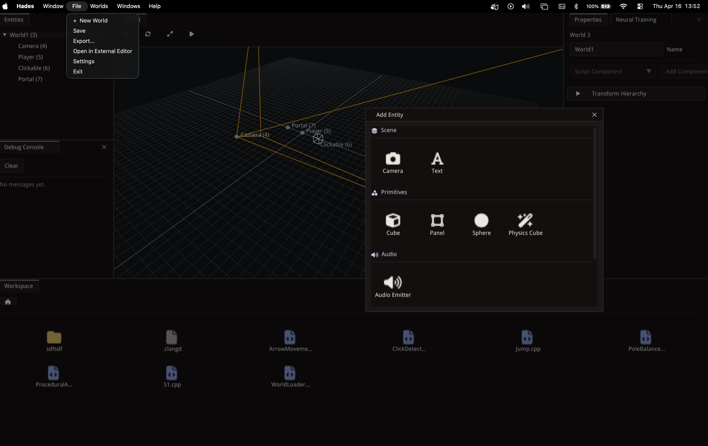
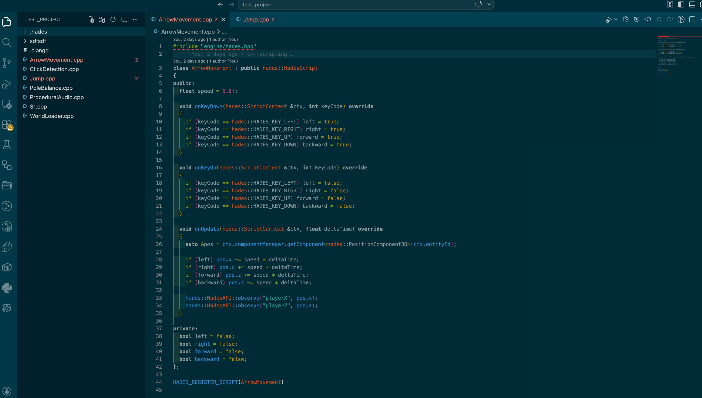
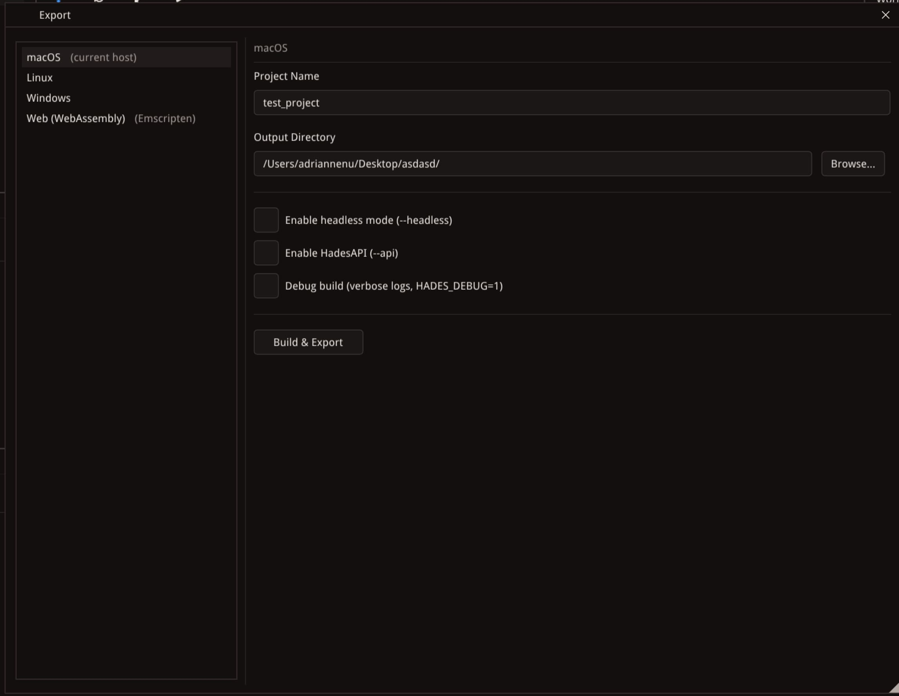
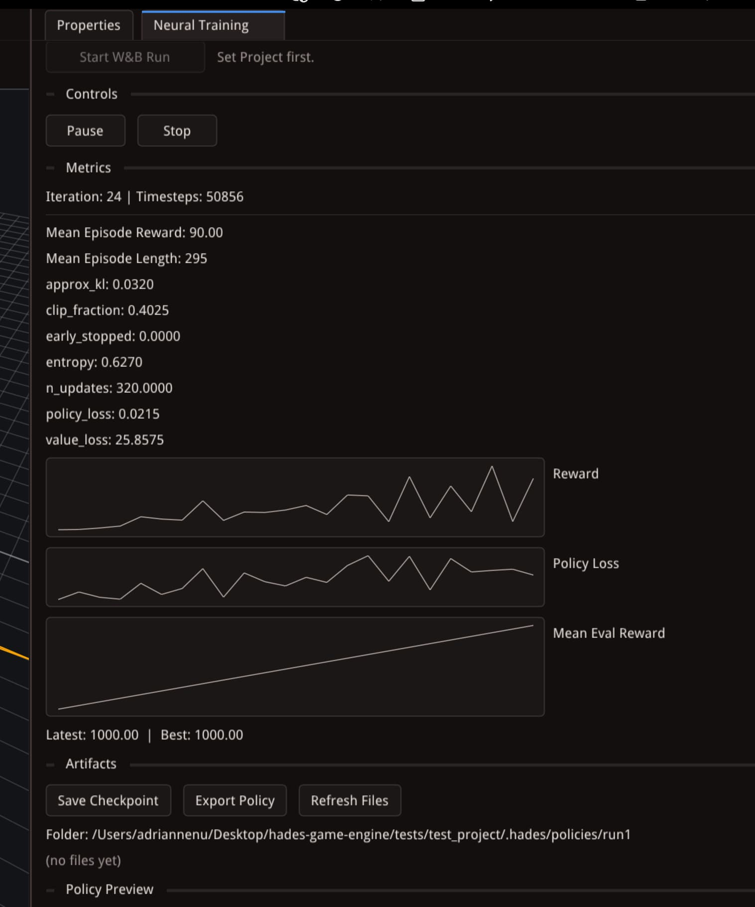
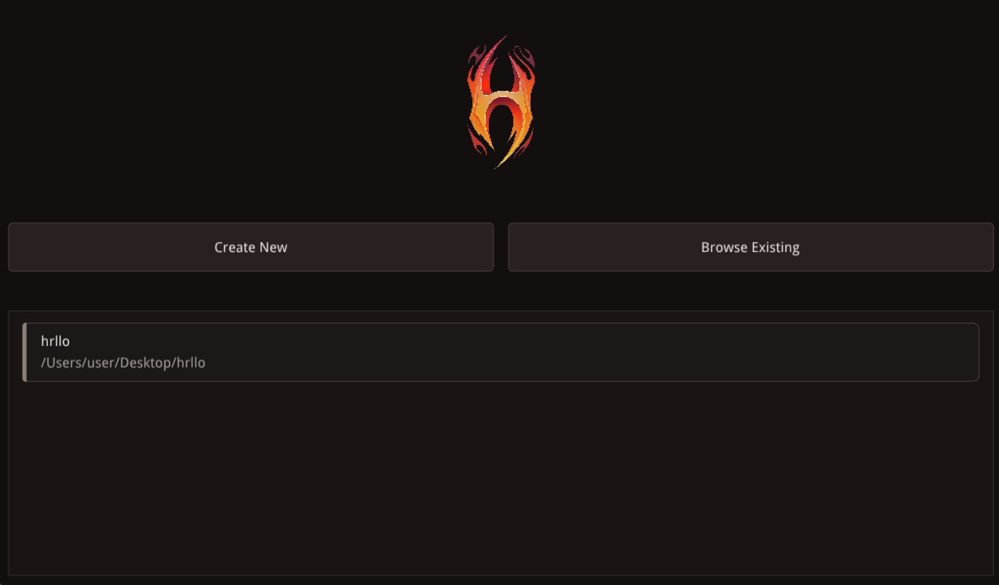

# Hades — Light C++ 3D Game Engine

  

A C++ 3D game engine with a Vulkan renderer, in-process C++ scripting, spatial audio, and an ImGui-based editor. Built around a custom Entity-Component-System.

Educational and experimental. Also designed for ML/RL training through a headless mode and a REST API.

## Features

**Rendering** — Vulkan renderer with swapchain, frame sync, and validation layers; ImGui with docking/multi-viewport; software-rasterised model preview; vector-based 3D text.

**ECS** — 13 component types, 3 runtime systems (Audio, Movement, Render), parent-child hierarchy, multi-world scenes, JSON serialization.

**Scripting** — In-process C++ scripts compiled to shared libraries at play start, direct ECS access, input callbacks, screen-to-world raycasts. See [scripting](docs/scripting.md).

**Audio** — SoLoud engine with 3D spatial audio and 4 buses (Master / Music / Sfx / Voice).

**Editor** — Workspace file tree, entity hierarchy with drag-reparenting, 3D viewport with orbit camera and transform gizmos, inspector, integrated syntax-highlighted script editor, debug console, play mode, plugin system.

**Neural / RL** — `hades-neural-engine` integration: PPO training panel, TorchScript policy export, in-engine inference.

**HadesAPI** — Optional REST API to step the simulation, read observations, and inject inputs. See [api](docs/api.md).

**Build** — CMake, C++20, cross-platform (macOS / Linux / Windows), GoogleTest.

## Third-party libraries

| Library | Use |
|---------|-----|
| [Vulkan SDK](https://www.lunarg.com/vulkan-sdk/) / [MoltenVK](https://github.com/KhronosGroup/MoltenVK) | Rendering backend |
| [Dear ImGui](https://github.com/ocornut/imgui) (docking branch) | Editor UI |
| [SDL2](https://www.libsdl.org/) | Windowing & input |
| [SoLoud](https://github.com/jarikomppa/soloud) | Audio engine |
| [Jolt Physics](https://github.com/jrouwe/JoltPhysics) | Physics |
| [nlohmann/json](https://github.com/nlohmann/json) | Serialization |
| [cpp-httplib](https://github.com/yhirose/cpp-httplib) | REST server |
| [CLI11](https://github.com/CLIUtils/CLI11) | CLI parsing |
| [GoogleTest](https://github.com/google/googletest) | Unit tests |
| [ImGuiColorTextEdit](https://github.com/BalazsJako/ImGuiColorTextEdit) | Script editor widget |
| [hades-neural-engine](https://github.com/nenuadrian/hades-neural-engine) | RL / inference (submodule) |

Pinned versions live in [cmake/Dependencies.cmake](cmake/Dependencies.cmake).

## Build

Per-OS minimal instructions:

- [macOS](docs/building/macos.md)
- [Linux](docs/building/linux.md)
- [Windows](docs/building/windows.md)
- [Overview — submodules, flags, testing](docs/building/overview.md)

## Documentation

Full site: <https://nenuadrian.github.io/hades-game-engine/>

- [Scripting](docs/scripting.md) — C++ scripts and the `NeuralScript` base
- [HadesAPI](docs/api.md) — REST endpoints for ML loops
- [Architecture](docs/architecture.md) — module layout
- [Frame metrics](docs/metrics.md) — per-frame profiling
- [Release process](docs/release.md) — tagging and artifacts

## Previous renderer backends

Metal, OpenGL, now Vulkan. Last pre-Vulkan commit: [`507e1d5c`](https://github.com/nenuadrian/hades-game-engine/tree/507e1d5c3bece7e09d78d668d4e3d652be0b2431).

## License

MIT. See [LICENSE](LICENSE).
