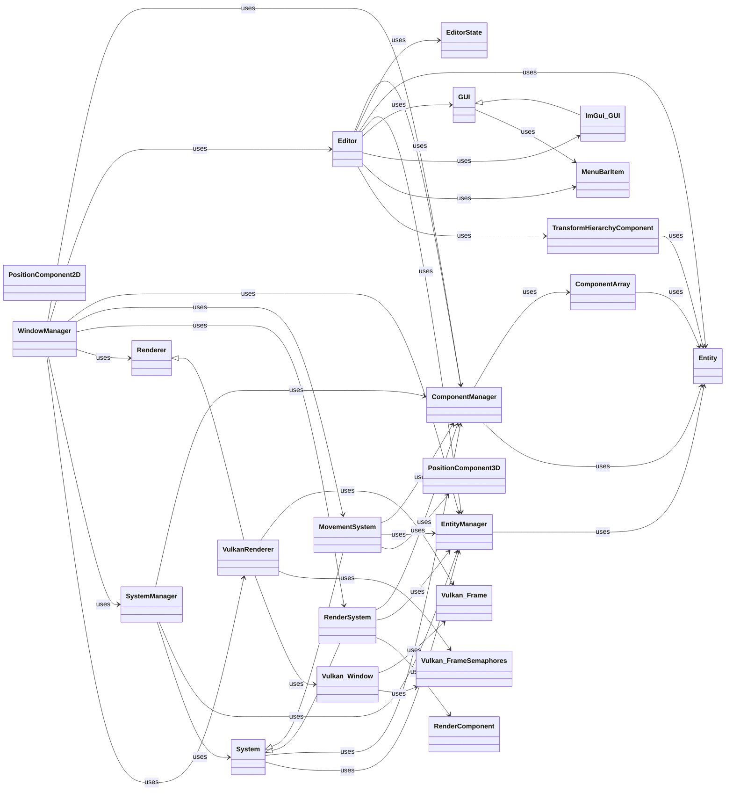

# Class Relationship Diagram

This page is auto-generated from `src/**/*.h*` by `scripts/generate_class_diagram.py`.

## Classes

| Class | Kind | Header |
|---|---|---|
| `ComponentArray` | `class` | `src/engine/core/ecs/component_array.hpp` |
| `ComponentManager` | `class` | `src/engine/core/ecs/component_manager.hpp` |
| `Editor` | `class` | `src/editor/editor.hpp` |
| `EditorState` | `struct` | `src/editor/types.h` |
| `Entity` | `class` | `src/engine/core/ecs/entity.hpp` |
| `EntityManager` | `class` | `src/engine/core/ecs/entity_manager.hpp` |
| `GUI` | `class` | `src/engine/gui/gui.hpp` |
| `ImGui_GUI` | `class` | `src/engine/gui/imgui.hpp` |
| `MenuBarItem` | `struct` | `src/engine/gui/gui.hpp` |
| `MovementSystem` | `class` | `src/engine/systems/movement_system.hpp` |
| `PositionComponent2D` | `class` | `src/engine/components/position_component_2d.hpp` |
| `PositionComponent3D` | `class` | `src/engine/components/position_component_3d.hpp` |
| `RenderComponent` | `struct` | `src/engine/components/render_component.hpp` |
| `RenderSystem` | `class` | `src/engine/systems/render_system.hpp` |
| `Renderer` | `class` | `src/engine/rendering/renderer.hpp` |
| `System` | `class` | `src/engine/core/ecs/system.hpp` |
| `SystemManager` | `class` | `src/engine/core/ecs/system_manager.hpp` |
| `TransformHierarchyComponent` | `class` | `src/engine/components/transform_hierarchy_component.hpp` |
| `VulkanRenderer` | `class` | `src/engine/rendering/vulkan.hpp` |
| `Vulkan_Frame` | `struct` | `src/engine/rendering/vulkan.hpp` |
| `Vulkan_FrameSemaphores` | `struct` | `src/engine/rendering/vulkan.hpp` |
| `Vulkan_Window` | `struct` | `src/engine/rendering/vulkan.hpp` |
| `WindowManager` | `class` | `src/editor/window_manager.hpp` |
