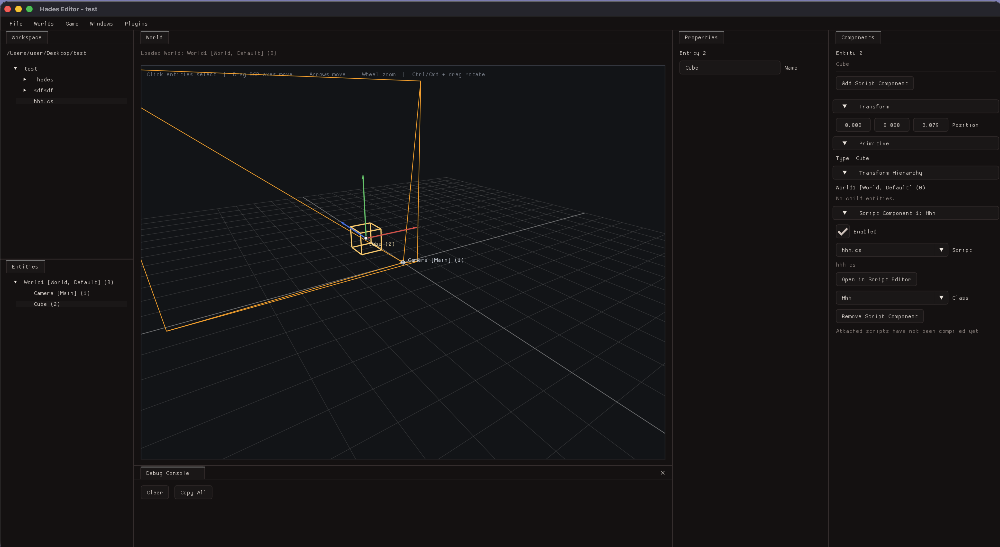

---
hide:
  - toc
---

# Hades — Light C++ 3D Game Engine

A C++ 3D game engine with a Vulkan renderer, in-process C++ scripting, spatial audio, and an ImGui-based editor. Built around a custom Entity-Component-System.

Educational and experimental. Also designed for ML/RL training through a headless mode and a REST API.

## Features

**Rendering** — Vulkan renderer with swapchain, frame sync, and validation layers; ImGui with docking/multi-viewport; software-rasterised model preview; vector-based 3D text.

**ECS** — 13 component types, 3 runtime systems (Audio, Movement, Render), parent-child hierarchy, multi-world scenes, JSON serialization.

**Scripting** — In-process C++ scripts compiled to shared libraries at play start, direct ECS access, input callbacks, screen-to-world raycasts. See [Scripting](scripting.md).

**Audio** — SoLoud engine with 3D spatial audio and 4 buses (Master / Music / Sfx / Voice).

**Game UI** — canvas + widget system for HUDs, menus, and world-space widgets (billboarded health bars with distance fade), driven from C++ scripts (`hades::UI`) and Blueprint `UI` nodes, with variable binding and click events. See [Game UI](ui.md).

**Editor** — Workspace file tree, entity hierarchy with drag-reparenting, 3D viewport with orbit camera and transform gizmos, Game View (renders the world through its main camera exactly as play mode does, with the editor overlays off), inspector, integrated script editor, debug console, play mode, plugin system.

**Neural / RL** — `hades-neural-engine` integration: PPO training panel, TorchScript policy export, in-engine inference.

**HadesAPI** — REST API to step the simulation, read observations, and inject inputs. See [HadesAPI](api.md).

**Build** — CMake, C++20, cross-platform (macOS / Linux / Windows), GoogleTest.

## Third-party libraries

| Library | Use |
|---------|-----|
| [Vulkan SDK](https://www.lunarg.com/vulkan-sdk/) / [MoltenVK](https://github.com/KhronosGroup/MoltenVK) | Rendering backend |
| [Dear ImGui](https://github.com/ocornut/imgui) (docking) | Editor UI |
| [SDL2](https://www.libsdl.org/) | Windowing & input |
| [SoLoud](https://github.com/jarikomppa/soloud) | Audio engine |
| [Jolt Physics](https://github.com/jrouwe/JoltPhysics) | Physics |
| [nlohmann/json](https://github.com/nlohmann/json) | Serialization |
| [cpp-httplib](https://github.com/yhirose/cpp-httplib) | REST server |
| [CLI11](https://github.com/CLIUtils/CLI11) | CLI parsing |
| [GoogleTest](https://github.com/google/googletest) | Unit tests |
| [ImGuiColorTextEdit](https://github.com/BalazsJako/ImGuiColorTextEdit) | Script editor widget |
| [hades-neural-engine](https://github.com/nenuadrian/hades-neural-engine) | RL / inference (submodule) |

## Getting started

- Building: [macOS](building/macos.md) · [Linux](building/linux.md) · [Windows](building/windows.md) · [Overview](building/overview.md)
- [Scripting](scripting.md)
- [HadesAPI (REST)](api.md)
- [Architecture](architecture.md)
- [Frame metrics](metrics.md)
- [Release process](release.md)
